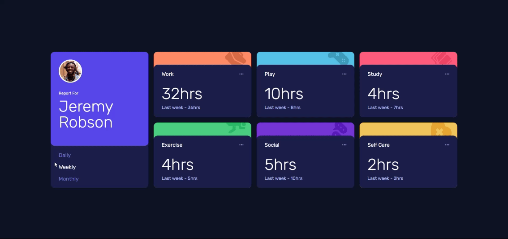

# Time tracking dashboard 

## Table of contents

- [Overview](#overview)
  - [The challenge](#the-challenge)
  - [Screenshot](#screenshot)
  - [Links](#links)
- [My process](#my-process)
  - [Built with](#built-with)
  - [What I learned](#what-i-learned)
  - [Useful resources](#useful-resources)
- [Author](#author)
- [Feedback](#feedback)

## Overview

### The challenge

Users should be able to:

- View the optimal layout for the site depending on their device's screen size
- See hover states for all interactive elements on the page
- Switch between viewing Daily, Weekly, and Monthly stats

### Screenshot

### Links

- Solution URL: [https://github.com/nikhil-131/time-tracking-dashboard.git](https://github.com/nikhil-131/time-tracking-dashboard.git)
- Live Site URL: [https://nikhil-131.github.io/time-tracking-dashboard/](https://nikhil-131.github.io/time-tracking-dashboard/)

## My process

### Built with

- Semantic HTML5 markup
- CSS custom properties
- Flexbox
- CSS Grid
- Mobile-first workflow
- [React](https://reactjs.org/) - JS library
- [Tailwindcss](https://tailwindcss.com/) - Utility-first CSS framework

### What I learned

I learned how to efficiently use semantic HTML5 markup to structure the content of the page. Additionally, I enhanced my skills in CSS, particularly in using flexbox and CSS grid for layout design. Incorporating a mobile-first workflow helped me ensure a responsive design across different devices. Moreover, working with React improved my understanding of building interactive web applications.

### Useful resources

- [Font Awesome](https://fontawesome.com/) - This site gave me all kinds of icons/logos in the required type. I liked this site and will be using it.

## Author

- Website - [Nikhil R](https://nikhil-131.github.io/portfolio/)
- LinkedIn - [@nikhil-r-rawal](https://www.linkedin.com/in/nikhil-r-rawal)
- Twitter - [@NikhilRRawal](https://www.twitter.com/NikhilRRawal)

## Feedback

I would greatly appreciate feedback on the advice generator web application. Your insights and suggestions would be invaluable for further enhancement.
